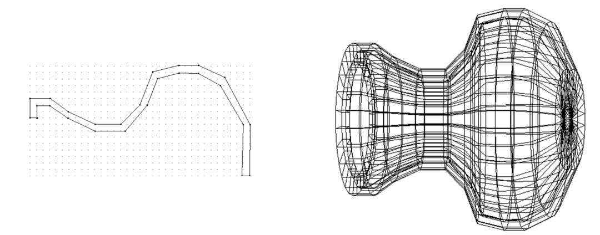
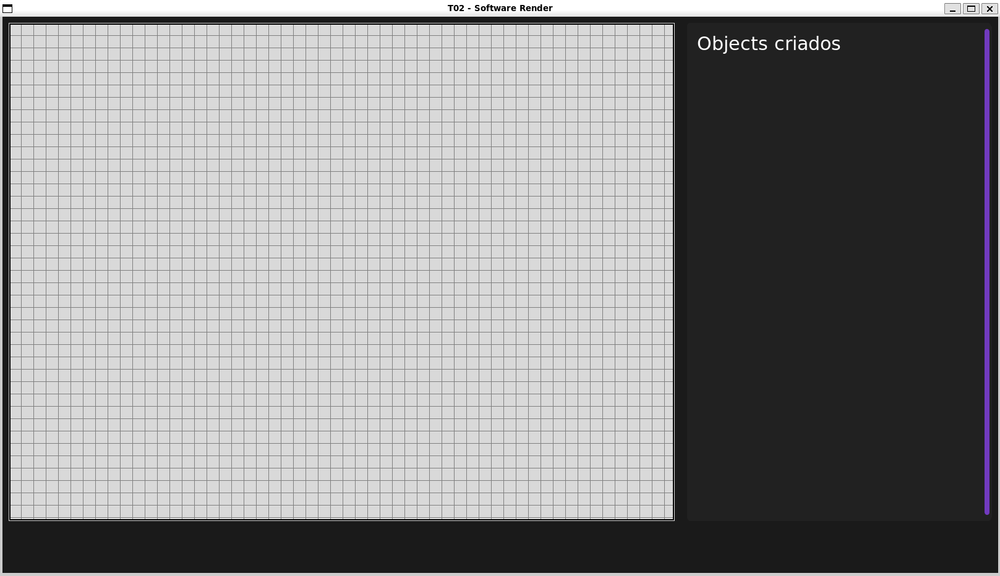
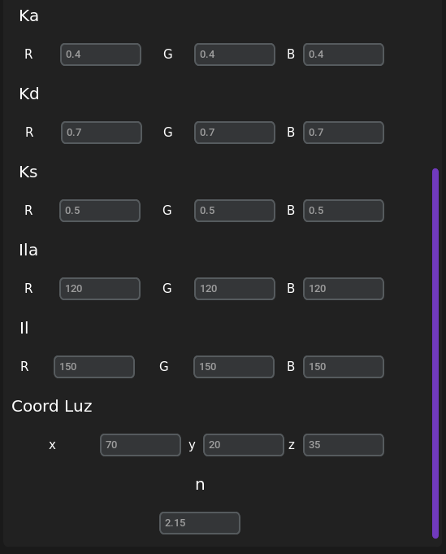
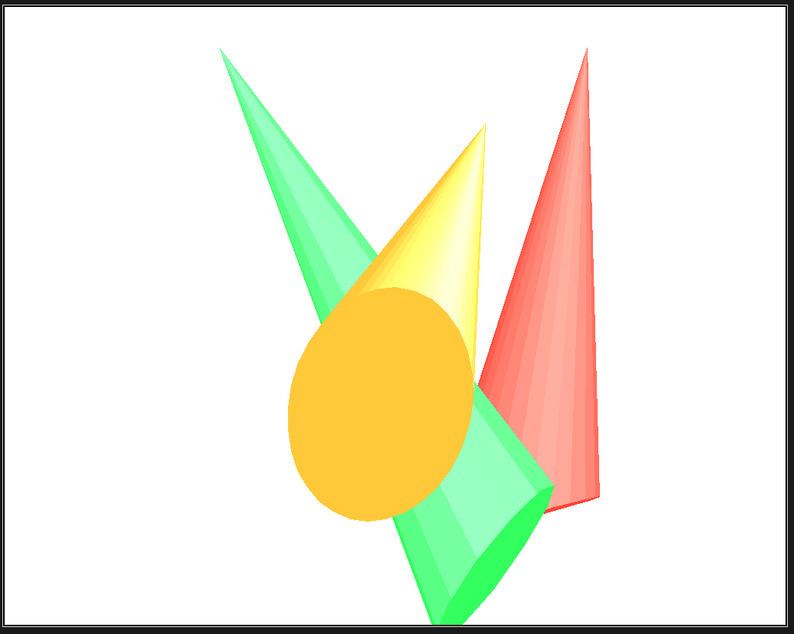

# <p align="center">Algoritmo Software Render e Wireframe</p>
#### <p align="center">Trabalho de Computação Gráfica, faculdade de Ciência da Computação, UNIOESTE (Universidade Estadual do Oeste do Paraná)</p>
##### <p align="center">Desenvolvido por: [Gabriel Mazzuco](https://github.com/gabrielmazz) e [Rodrigo Rocha](https://github.com/Rodrigo2603)</p>

# <p align="center">Introdução</p>

Neste trabalho foi desenvolvido um algoritmo de renderização de polígonos 3D, utilizando a linguagem de programação Python e a biblioteca tkinter. Primeiramento foi realizado a coleta dos pontos num ambiente 2D chamado de Wireframe, posteriormente foi realizado a revolução do objeto em torno de um eixo, gerando um objeto em 3D

<br>

<p align="center">
    
</p>

<p align="center">
    
</p>

# <p align="center">Implementação</p>


O objeto 3D está apresentado na técnica wireframe, sem ocultação de superfícies. O número de fatias usadas na revolução foi igual a 30, ou seja, a cada 360º/30 = 12º criou-se um paralelo para delimitar as faces do objeto. É possivel colocar mais de um objeto em tela também, basta apenas desenhar os objetos no wireframe.

<p align="center">
    
</p>

No wireframe é possível escolher a quantidade de fatias que o objeto terá para revolucionar, alem de escolher a própria cor do objeto

<p align="center">
    
</p>

<p align="center">
    
</p>


Com o sólido totalmente gerado, parte-se para a rederização do objeto, é feito a partir do tkinter em um canvas determinado, mostrando-o previamente em tela. É feito a partir de uma técnica de renderização de polígonos 3D em um ambiente 2D, utilizando a técnica de projeção


<p align="center">
    
</p>


## <p align="center">Parametrização</p>

Para realizar as matrizes de transformações, o usuário deverá informar os valores utilizados na *view-port*, *view-up*, *vrp*, *ponto focal*, *distância ao plano* e da *janela do mundo*. Dependendo dos valores informados, o objeto terá uma visualização diferente.

Com estes valores, é realizado o *pipeline* que consiste na transformação dos pontos do objeto 3D, utilizando as matrizes SRU (Sistema de Referência do Universo), de projeção (perspectiva ou ortogonal), janela view-port e por fim a matriz SRT (Sistema de Referência da Tela).

<p align="center">
    
</p>

Na realização da parametrização do sombreamento, será passado os valores de *refração ambiente (Ka)*, *difusa (Kd)* e *especular (Ks)*, além do grau de *luz do ambiente (Ila)* e da *luz focal (Il)*. Por fim também deve-se informar a *aproximação da distribuição espacial da luz refletida especularmente* (n)

<p align="center">
    
</p>

Depois de realizar a parametrização de todos os valores, é possivel realizar o sombreamento (constante) em todas as faces do objeto, com base nos calculos de iluminação, visto durante a matéria de Computação Gráfica.

<p align="center">
    
</p>


## <p align="center">Detalhes da implementação</p>

O código funciona com três núcleos principais, sendo eles o **wireframe**, a **revolução do objeto** e o **software render**, sendo todos implementados usando orientação a objetos. São criado duas telas direntes, primeiro sendo o próprio wireframe, e posteriormente ele é "destruido", dando lugar ao software render.

- Todo o programa, só é possivel por causa da utilização do *openmesh* pois ele cria uma malha com os pontos aonde é salvo seus vertices, faces geradas pós a revolução

```python	

# Wireframe
    
# Cria a classe do wireframe
screen_wireframe = Screen_Wireframe()

# Deleta os arquivos de pontos
screen_wireframe.delete_points_file()

# Registra os clicks no programa
screen_wireframe.register_click()

# Roda o programa
screen_wireframe.run()

```

O cerne do programa está na manipulação da lista de classes, uma lista em que possui todo o objeto armazenado no arquivo `object_3d.py`

```python	
# Revolução do objeto
files_classes = []

# Cria a quantidade de classes de objetos referente a quantidade de arquivos de pontos
for file in os.listdir(os.path.join("Wireframe", "points")):
        
    # Cria as classes dos objetos
    files_classes.append(Points_Object(file))
    
# Converte os pontos dos arquivos para pontos na linha
for file in files_classes:
    file.points_file_to_points_line()
    
# Roda a revolução dos objetos
for file in files_classes:
    file.revolucion()
```

Dentro do arquivo `object_3d.py`, temos toda a classe, indo dos seus pontos 2D resgatados do wireframe, até seus pontos xn, yn e zn posteriores a sua revolução. Além de salvar qual a sua cor principal e seus parametros de transformações (rotação, translacao e escala) que são funções dentro do objeto.

```python
class Points_Object():
    
    def __init__(self, name):
        
        # Nome do arquivo
        self.name = name
        
        # Pontos no campo 2D
        self.points_line = []    
        self.x = []
        self.y = []
        
        # Pontos no campo 3D
        self.points_x = []
        self.points_y = []
        self.points_z = []
        
        # Revolução
        self.slices = None
        self.theta = None
        self.xn = None
        self.yn = None
        self.zn = None
        
        # Define a cor do objeto
        self.color = None
        
        # Define os parametros de rotacao, translacao e escala
        self.rotacao = np.array([0, 0, 0]) # -> [rotacao_x, rotacao_y, rotacao_z]
        self.translacao = np.array([0, 0, 0])
        self.escala = 1
```

```python

def update_rotacao(self, dx, dy, dz):
    self.rotacao += np.array([dx, dy, dz])
    
def update_translacao(self, dx, dy):
    self.translacao += np.array([dx, dy, 0])
    
def update_escala(self, fator):
    self.escala *= fator
    
def update_color(self, color):
    self.color = color

```
Dentro do software render, temos toda a composição da tela que nem o wireframe, mas toda a manipulação é feita a partir do tkinter. Com parametros definidos, ele começa a realizar as transformações, com vários arquivos em várias outras pastas, como são as matrizes do pipeline

```python
# Calcula a matriz de transformação Msru_src
self.Matrix_sru_src = Msru_src(vrp_x, vrp_y, vrp_z, 
                    ponto_focal_x, ponto_focal_y, ponto_focal_z, 
                    view_up_x, view_up_y, view_up_z)

# Calcula a matriz de projeção
self.Matrix_proj = Mproj_perspectiva(dp)

# Calcula a matriz de janela de projeção
self.Matrix_jp = Mjp(uMin, uMax, vMin, vMax,
            janela_mundo_xMin, janela_mundo_xMax, janela_mundo_yMin, janela_mundo_yMax)

# Calcula a matriz de transformação Msru_srt
self.Matrix_sru_srt = Msru_srt(self.Matrix_sru_src, self.Matrix_proj, self.Matrix_jp)
```

Quando tudo já está feito e o programa já possui a matriz concatenada da transformação so SRU para o SRT, ele computa os vertices multiplicando ele pela matriz obtido. Lembrando que isso é feito para todos os objetos simultaneamente

```python
# Computa os vertices com a matriz de transformação obtida anteriomente
for i in range(len(self.files_classes)):
    
    # Separa a mash do objeto (apenas por conveniência)
    mesh = copy.deepcopy(self.files_classes[i].mesh)
    
    mesh_mod = computacao_dos_vertices(mesh, self.Matrix_sru_srt)
    
    mesh_objetos_modificado.append(mesh_mod)
```

Depois de computado, parte-se para o teste de visibilidade de face, algo que testa se é possivel enxergar com os parametros já definidos (Não está sendo feito de forma correta e pode deformar o objeto)

```python
 mesh_objetos_modificado_verificacao_faces = []
for mesh in mesh_objetos_modificado:
    
    # Verifica se as faces são visíveis
    mesh_objetos_modificado_verificacao_faces.append(verifica_faces_visiveis(mesh, vrp_x, vrp_y, vrp_z, ponto_focal_x, ponto_focal_y, ponto_focal_z))
```

Ao descobrir quais faces são visíveis, parte-se para o sombreamento, algo que é feito com base nos parametros de iluminação e de sombreamento, que são passados pelo usuário, também sendo feito em outro arquivo de forma separada

```python
mesh_objeto_modificado_sombreamento = []
for i in range(len(mesh_objetos_modificado_verificacao_faces)):
    
    # Aplica uma copia da mesh modificada
    mesh_objeto_sombreamento = copy.deepcopy(mesh_objetos_modificado_verificacao_faces[i])
    
    print(mesh_objeto_sombreamento)
    
    # Percorre todas as faces da mesh
    for fh in mesh_objetos_modificado[i].faces():
        
        mesh_objeto_sombreamento = aplicacao_sombreamento(mesh_objetos_modificado[i], fh, 
                                                        vrp_x, vrp_y, vrp_z,
                                                        luz_ambiente_Ila_r, luz_ambiente_Ila_g, luz_ambiente_Ila_b,
                                                        luz_pontual_Il_r, luz_pontual_Il_g, luz_pontual_Il_b,
                                                        coordenadas_fonte_luz_x, coordenadas_fonte_luz_y, coordenadas_fonte_luz_z,
                                                        sombreamento_Ka_r, sombreamento_Ka_g, sombreamento_Ka_b,
                                                        sombreamento_Kd_r, sombreamento_Kd_g, sombreamento_Kd_b,
                                                        sombreamento_Ks_r, sombreamento_Ks_g, sombreamento_Ks_b, n)
                                
    # Adiciona a mesh modificada com o sombreamento constante
    mesh_objeto_modificado_sombreamento.append(mesh_objeto_sombreamento)
```

Com tudo isso realizado, é dado o update no canvas e é rederizado o objeto com seus vertices modificados, faces visíveis e com o sombreamento constante, podendo ser manipulado novamente com as suas transformações


# <p align="center">Como usar o aplicativo</p>

## <p align="center">Wireframe</p>

Para desenhar o objeto 2D, basta apenas clicar no grid com `botão direito do mouse`, isso ira desenhar as retas e formando um objeto em tela, tendo no mínimo 2 pontos para revolucionar. Com ele desenhando, clica-se `q` para salvar o objeto na fila de classes indicada para ele

## <p align="center">Renderização</p>

Dentro do aplicativo de fato, é possivel realizar alguns comandos. Quando o usuário parametrizar tudo que deseja, clica-se o botão `F2` para rederizar o pipeline e sombreamento.

### <p align="center">Botões extras</p>

- `F1` - Printa os valores armazenados no terminal
- `F9` - Mostra num gráfico do matplotlib o sólido(s) gerado(s)
- `F10` - Retira os gráficos da tela
- `F12` - Fecha o aplicativo (também aplicado no wireframe)
- `U` - Atualiza o canvas depois de realizar as transformações
- `R` - Reseta o objeto para antes da parametrização
- `←, →, ↑, ↓` - Movimenta o objeto no canvas
- `w` - Rotação no eixo x (+)
- `s` - Rotação no eixo x (-)
- `a` - Rotação no eixo y (+)
- `d` - Rotação no eixo y (-)
- `q` - Rotação no eixo z (+)
- `e` - Rotação no eixo z (-)
- `z` - Escala o objeto (+)
- `x` - Escala o objeto (-)

Para as movimentações dos objetos, é possivel selecionar qual objeto quer que se altere, basta escolhe-lo no menu. Ele irá seleciona-lo previamente possibilitando a movimentação.

<p align="center">
    
</p>


# <p align="center">Como executar</p>

Para executar o aplicativo, basta apenas rodar o arquivo `main.py` que está na raiz do projeto. Para isso, é necessário ter instalado as bibliotecas `customtkinter` e `openmesh`. Você pode apenas dar o comando `./atualizacao.bash` mas apenas no linux, para instalar as dependências.


# <p align="center">Arquivos extras</p>

- `Planilha.xlsx` - Planilha com os valores de parametrização (disponibilizado pelo professor da disciplina)
- `atualizacao.bash` - Script para instalar as dependências do projeto
- `Trabalho 2 - CG 2023` - PDF com a descrição do trabalho

# <p align="center">Problemas que o software possui</p>

- Seleção dos pontos no wireframe é feito corretamente e sua revolução também, mas quando aplicado as transformações junto com a ocultação de faces, não é feito de forma correta
- Parametrização do valor *n* não está sendo feito corretamente, no calculo é gerado um vetor quando se eleva (potencia), por isso por padrão está 2.15
- Quanto mais objeto e faces que eles possuirem, o software pode ficar lento, pois não foi feito a otimização do código e o tkinter tem várias limitações em relação a mostrar objetos que não sejam simples e que exijam muitos cálculos, transformações e renderizações em tempo de execução

# <p align="center">Requisitos mínimos de hardware</p>

- Processador: Intel Core i3 ou superior
- Memória RAM: 4GB ou superior
- Espaço em disco: 1GB ou superior
- Sistema operacional: Windows 10 | 11 ou Linux

# <p align="center">Referências</p>

- Ramadhar, V. Draw-Surface-Revolution. GitHub. Acessado em 04 de abril de 2024, de https://github.com/vivek-ramadhar/Draw-Surface-Revolution

- Schimansky, T. CustomTkinter. Acessado em 12 de maio de 2024, de https://customtkinter.tomschimansky.com

- Python Software Foundation. (n.d.). Tkinter.ttk — Tk themed widgets. Recuperado em 31 de maio de 2024, de https://docs.python.org/pt-br/3/library/tkinter.ttk.html#using-ttk

- RWTH Aachen University. (n.d.). OpenMesh. Recuperado em 12 de maio de 2024, de https://www.graphics.rwth-aachen.de/software/openmesh/

- Adair, S. C. Transformações Geométricas. Recuperado em 04 de abril de 2024, de https://www.inf.unioeste.br/~adair/CG/Notas%20Aula/Slides%2004%20-%20Transformacoes%20Geometricas.pdf

- Adair, S. C.  Visualização em 3D. Recuperado em 04 de abril de 2024, de https://www.inf.unioeste.br/~adair/CG/Notas%20Aula/Slides%2005%20-%20Visualizacao%20em%203D.pdf

- Adair, S. C. Iluminação e Sombreamento. Recuperado em 04 de abril de 2024, de https://www.inf.unioeste.br/~adair/CG/Notas%20Aula/Slides%2008%20-%20Iluminacao%20e%20Sombreamento.pdf

- Microsoft Corporation. (2023). Microsoft Copilot. https://copilot.github.com

- ChatGPT. (2023). Resposta de assistente de IA. OpenAI. https://chat.openai.com