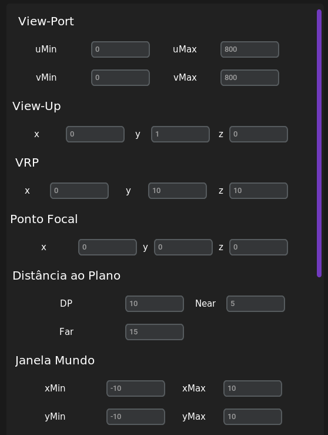

# 
Algoritmo Software Render e Wireframe

#### 
Trabalho de Computação Gráfica, faculdade de Ciência da Computação, UNIOESTE (Universidade Estadual do Oeste do Paraná)

##### 
Desenvolvido por: [Gabriel Mazzuco](https://github.com/gabrielmazz) e [Rodrigo Rocha](https://github.com/Rodrigo2603)

# 
Introdução

Neste trabalho foi desenvolvido um algoritmo de renderização de polígonos 3D, utilizando a linguagem de programação Python e a biblioteca tkinter. Primeiramento foi realizado a coleta dos pontos num ambiente 2D chamado de Wireframe, posteriormente foi realizado a revolução do objeto em torno de um eixo, gerando um objeto em 3D

 

    

# 
Implementação

O objeto 3D está apresentado na técnica wireframe, sem ocultação de superfícies. O número de fatias usadas na revolução foi igual a 30, ou seja, a cada 360º/30 = 12º criou-se um paralelo para delimitar as faces do objeto. É possivel colocar mais de um objeto em tela também, basta apenas desenhar os objetos no wireframe.

    

Com o sólido totalmente gerado, parte-se para a rederização do objeto, é feito a partir do tkinter em um canvas determinado, mostrando-o previamente em tela. É feito a partir de uma técnica de renderização de polígonos 3D em um ambiente 2D, utilizando a técnica de projeção

    

## 
Parametrização

Para realizar as matrizes de transformações, o usuário deverá informar os valores utilizados na *view-port*, *view-up*, *vrp*, *ponto focal*, *distância ao plano* e da *janela do mundo*. Dependendo dos valores informados, o objeto terá uma visualização diferente.

Com estes valores, é realizado o *pipeline* que consiste na transformação dos pontos do objeto 3D, utilizando as matrizes SRU (Sistema de Referência do Universo), de projeção (perspectiva ou ortogonal), janela view-port e por fim a matriz SRT (Sistema de Referência da Tela).

    

Na realização da parametrização do sombreamento, será passado os valores de *refração ambiente (Ka)*, *difusa (Kd)* e *especular (Ks)*, além do grau de *luz do ambiente (Ila)* e da *luz focal (Il)*. Por fim também deve-se informar a *aproximação da distribuição espacial da luz refletida especularmente* (n)

    

Depois de realizar a parametrização de todos os valores, é possivel realizar o sombreamento (constante) em todas as faces do objeto, com base nos calculos de iluminação, visto durante a matéria de Computação Gráfica.

    

# 
Como usar o aplicativo

## 
Wireframe

Para desenhar o objeto 2D, basta apenas clicar no grid com `botão direito do mouse`, isso ira desenhar as retas e formando um objeto em tela, tendo no mínimo 2 pontos para revolucionar. Com ele desenhando, clica-se `q` para salvar o objeto na fila de classes indicada para ele

## 
Renderização

Dentro do aplicativo de fato, é possivel realizar alguns comandos. Quando o usuário parametrizar tudo que deseja, clica-se o botão `F2` para rederizar o pipeline e sombreamento.

### 
Botões extras

- `F1` - Printa os valores armazenados no terminal
- `F9` - Mostra num gráfico do matplotlib o sólido(s) gerado(s)
- `F10` - Retira os gráficos da tela
- `F12` - Fecha o aplicativo (também aplicado no wireframe)
- `U` - Atualiza o canvas depois de realizar as transformações
- `R` - Reseta o objeto para antes da parametrização
- `←, →, ↑, ↓` - Movimenta o objeto no canvas
- `w` - Rotação no eixo x (+)
- `s` - Rotação no eixo x (-)
- `a` - Rotação no eixo y (+)
- `d` - Rotação no eixo y (-)
- `q` - Rotação no eixo z (+)
- `e` - Rotação no eixo z (-)
- `z` - Escala o objeto (+)
- `x` - Escala o objeto (-)

# 
Como executar

Para executar o aplicativo, basta apenas rodar o arquivo `main.py` que está na raiz do projeto. Para isso, é necessário ter instalado as bibliotecas `customtkinter` e `openmesh`. Você pode apenas dar o comando `./atualizacao.bash` mas apenas no linux, para instalar as dependências.

# 
Arquivos extras

- `Planilha.xlsx` - Planilha com os valores de parametrização (disponibilizado pelo professor da disciplina)
- `atualizacao.bash` - Script para instalar as dependências do projeto
- `Trabalho 2 - CG 2023` - PDF com a descrição do trabalho
